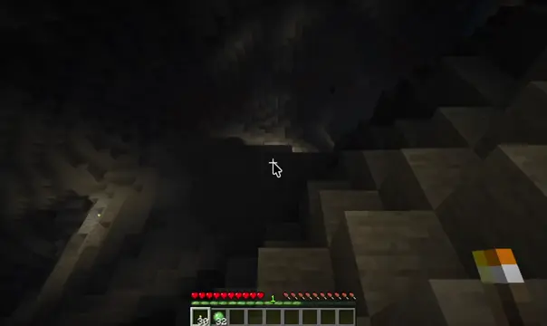
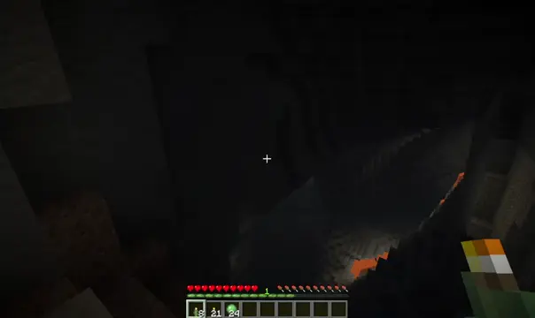
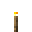
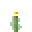
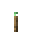
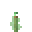
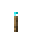
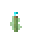
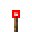
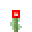

# Torched Minecraft mod: throwable and sticky torches

Ever wanted to throw a lit torch ahead of you, or down a dark cave?
Now you can!

This mod gives you the ability to:
- throw lit torches, which will stay lit when they land anywhere that would
support a lit regular torch
- craft sticky torches, which stick to walls and other vertical surfaces

All four torch types (regular, copper, soul, redstone) are supported and have a
sticky counterpart.

Torches, including sticky ones, place normally if a surface is within reach. By
default, torches will be thrown when trying to place on surfaces that are out of
reach. Torches can also be thrown by using a dedicated key.

| plain torch                 | sticky torch                |
|-----------------------------|-----------------------------|
|  |  |

## Configuration

The key binding (default `G`) is configurable under `Controls → Gameplay`.

With [Mod Menu](https://github.com/TerraformersMC/ModMenu) installed there is a settings screen behind the mod's
config button. Without it the same settings live in `config/torched.json`:

```json
{
  "throwOnUse": true,
  "throwVanillaTorches": true
}
```

- `throwOnUse` hooks into an existing interaction; turn it off (set to `false`)
if you'd rather right-click a torch without throwing it when pointing at
something out-of-reach, and use the key binding instead.

- `throwVanillaTorches` is enforced by the server. Set it to `false` to only
allow throwing sticky torches.

## Multiplayer servers

The mod must be installed on both the server and client. A vanilla client on a
modded server will not be able to throw torches.

## Crafting

You can craft sticky torches by combining a torch and a slimeball.

| Variant  | Combine                                                                      | Result                                              |
|----------|------------------------------------------------------------------------------|-----------------------------------------------------|
| Plain    |             |           |
| Copper   |      |    |
| Soul     |        |      |
| Redstone |    |  |

## Integrations

Required:
- [Fabric API](https://github.com/FabricMC/fabric-api)
- [Fabric Kotlin](https://github.com/FabricMC/fabric-language-kotlin/)

Optional:
- [LambDynamicLights](https://lambdaurora.dev/projects/lambdynamiclights/): Sticky torches have the same luminance as their
vanilla counterparts.
- [Mod Menu](https://github.com/TerraformersMC/ModMenu): Adds the configuration options to the mod menu.

## AI Disclosure

All of the mod code and tests (everthing under `src`) is human-written, though
AI was used for code review.

Code under [build-tools/gametest-entrypoint-validation](build-tools/gametest-entrypoint-verification) is ai-assisted,
human-reviewed and customized.

Any file touched by AI has the appropriate SPDX-AI headers.

Also see [ai_disclosure.md](ai_disclosure.md) and 

## License

Copyright (C) 2026-present Daniël van de Burgt

This program is free software: you can redistribute it and/or modify
it under the terms of the GNU Lesser General Public License as published by
the Free Software Foundation, either version 3 of the License, or
(at your option) any later version.

This program is distributed in the hope that it will be useful,
but WITHOUT ANY WARRANTY; without even the implied warranty of
MERCHANTABILITY or FITNESS FOR A PARTICULAR PURPOSE. See the
GNU Lesser General Public License for more details.
